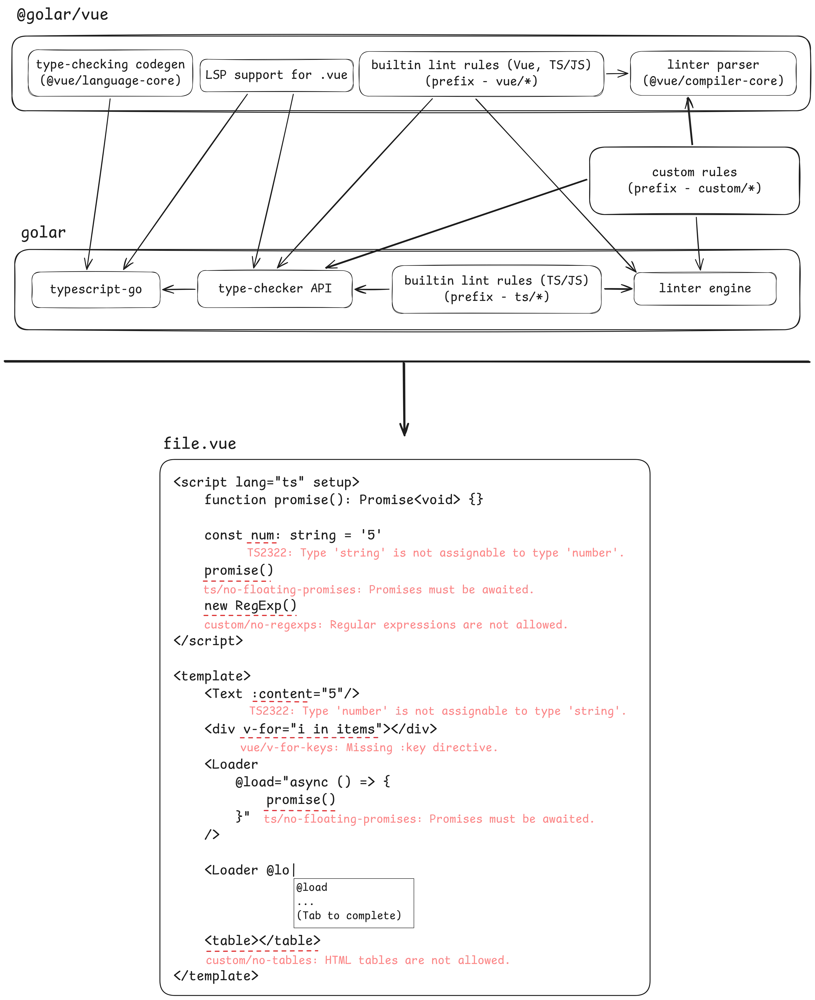
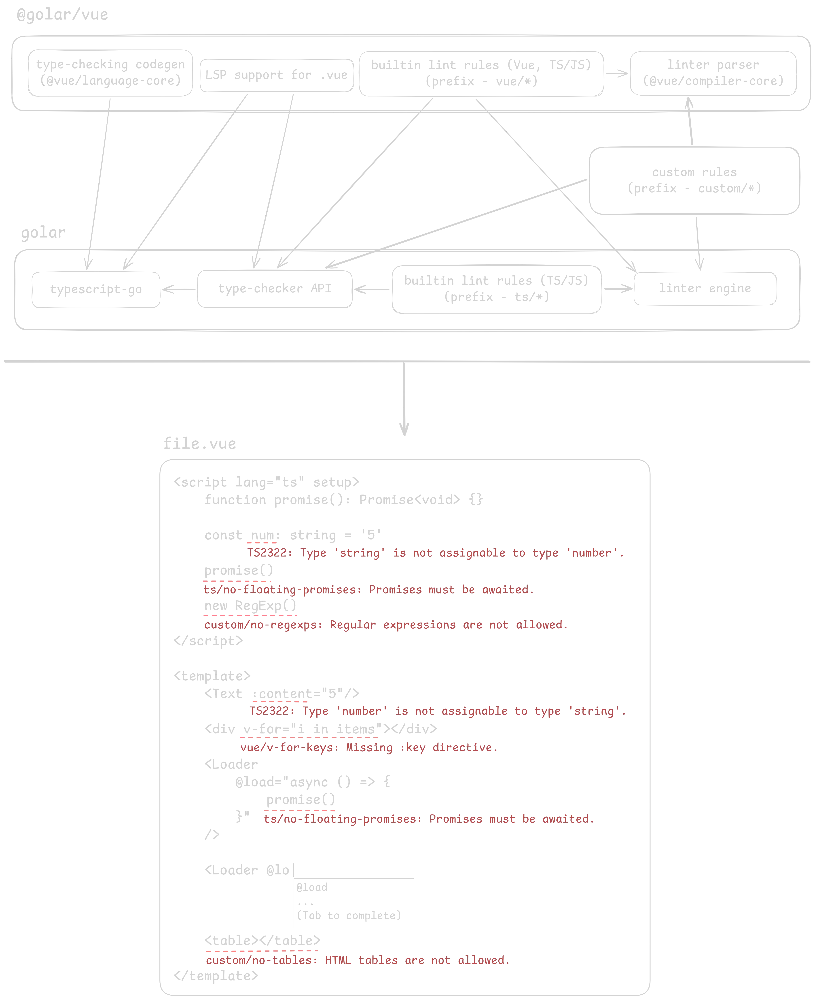

Golar first started as a direct wrapper around `tsgo` CLI.
However, I wanted to add a linter to it from the first day.

And I'm happy to announce that Golar finally gets its own experimental linter!

In this blog post I'm going to explain how Golar integrates linting, what Golar's current positioning is, and how I see its future.

## TypeScript-Based Language Tooling State

I separate web-development language tooling into four categories.

- **Syntax-only linting** -- Traditional AST only linting.
  It can catch a lot of obvious mistakes in code, however, it's rather limited due to the lack of type-awareness.
- **Type-aware linting** -- [Linting with TypeScript type information](https://typescript-eslint.io/blog/typed-linting/) is a superset of syntax-only linting.
  It can catch more mistakes and do it more accurately.
- **Type-checking** -- catches type errors in TypeScript code.
- **LSP features** -- autocompletion, hover, go-to-definition, showing errors in a text editor and so on.

Comprehensive support for each of these categories is essential for high-quality web-development language tooling.

We'll also consider two groups of languages:

- Supported by TypeScript natively (JavaScript/TypeScript, JSX/TSX) -- these languages don't require any extensions to the official TypeScript compiler.
- Custom TS-based languages (Astro, Svelte, Vue, and others) -- the TypeScript compiler is unaware of these languages and must be extended in order to support them.

:::note

In this blog post, I'll mention other linters and compare them with Golar from time to time.
The goal is not to dismiss their work.
I have a lot of respect for these projects, their authors and maintainers, and the amount of effort behind them.

I reference other linters only to explain where Golar fits within the current web-dev tooling landscape.
It would be difficult to discuss different approaches clearly without naming concrete projects that use them.

:::

### Before TypeScript-Go and New-Wave Tooling

For a very long time, all web-dev tooling -- including the TypeScript compiler -- was written in JavaScript.
And while it provided great developer experience, it was rather slow.

JS-based tooling had evolved to support _almost_ every part of the TypeScript-based language tooling landscape:

| Feature             | JavaScript/TypeScript | Astro, Svelte, Vue, and others |
| ------------------- | --------------------- | ------------------------------ |
| Syntax-only linting | ✅                    | ✅                             |
| Type-aware linting  | ✅                    | ⚠️                             |
| Type-checking       | ✅                    | ✅                             |
| LSP features        | ✅                    | ✅                             |

<div style="font-size: .8em">

> _✅ -- Supported_
>
> _⚠️ -- Limited support_

</div>

**Syntax-only linting** was solved by [ESLint](https://eslint.org/), [typescript-eslint](https://typescript-eslint.io/) and ESLint plugins ([eslint-plugin-astro](https://ota-meshi.github.io/eslint-plugin-astro/), [eslint-plugin-svelte](https://sveltejs.github.io/eslint-plugin-svelte/), [eslint-plugin-vue](https://eslint.vuejs.org/)).

**Type-aware linting** of JS/TS was solved by typescript-eslint.
For TS-based languages, though, support remained only _partial_.
For example, with `@typescript-eslint/parser`, imports of [`.astro`](https://github.com/ota-meshi/eslint-plugin-astro/issues/348), [`.svelte`](https://github.com/sveltejs/eslint-plugin-svelte/issues/1150), or [`.vue`](https://github.com/vuejs/vue-eslint-parser/issues/104) files are currently resolved to `any`.

Another limitation was that only the _script_ parts of these languages were checked.
As a result, JS expressions inside Astro, Svelte, and Vue templates could not be linted with TypeScript type information.

**Type-checking** and **LSP features** were solved by [Volar.js](https://volarjs.dev/) (used by [Astro Language Tools](https://github.com/withastro/astro/tree/main/packages/language-tools/astro-check) and [Vue Language Tools](https://github.com/vuejs/language-tools)) and custom language-specific TypeScript tooling ([Svelte Language Tools](https://github.com/sveltejs/language-tools)).

However, the ecosystem then started leaning towards native-speed tooling.
Rust-based linters had emerged, and finally, typescript-go came out!

### New-Wave Tooling

By "new-wave" tooling, I mean [Biome](https://biomejs.dev/), [Oxlint](https://oxc.rs/docs/guide/usage/linter.html) + [oxlint-tsgolint](https://github.com/oxc-project/tsgolint), and [typescript-go](https://github.com/microsoft/typescript-go).

| Feature             | JavaScript/TypeScript | Astro, Svelte, Vue, and others |
| ------------------- | --------------------- | ------------------------------ |
| Syntax-only linting | ✅                    | ✅                             |
| Type-aware linting  | ✅                    | ⚠️ or ❌                       |
| Type-checking       | ✅                    | ✅                             |
| LSP features        | ✅                    | ❌                             |

<div style="font-size: .8em">

> _✅ -- Supported_
>
> _⚠️ -- Limited support_
>
> _❌ -- Unsupported_

</div>

**Syntax-only linting** for JavaScript and TypeScript already works great (and super fast!) in Rust-based linters.
Linting of Astro, Svelte, and Vue is also already almost solved, mainly because there are no real technical barriers there.

**Type-aware linting** is a bit more difficult.
Since typescript-go is written in Go, it's non-trivial to integrate it with existing Rust-based linters.
However, oxlint-tsgolint bundles typescript-go and supports type-aware linting of JavaScript and TypeScript via rules written in Go.
Biome uses [custom Rust-based type inference](https://biomejs.dev/blog/biome-v2/), which performs very well in many cases, even though it is not the official TypeScript checker.

**Type-aware linting** of Astro, Svelte, and Vue is still an active area.
Biome can lint the _script_ parts of these languages with its custom type inference, although _template_ parts are not covered yet.
Flint [supports _fully type-aware linting_ of Astro, Svelte, and Vue](https://flint.fyi/blog/fully-type-aware-linting-for-astro-svelte-and-vue), but it currently targets TypeScript 6.0.

**Type-checking** for JavaScript and TypeScript is provided by typescript-go itself.
The community has also built several tools that add type-checking for Svelte ([`svelte-check --tsgo`](https://github.com/sveltejs/language-tools/pull/2932), [svelte-fast-check](https://github.com/astralhpi/svelte-fast-check), [svelte-check-rs](https://github.com/pheuter/svelte-check-rs)) and Vue ([vue-tsgo](https://github.com/KazariEX/vue-tsgo), [vize](https://github.com/ubugeeei/vize), [verter](https://github.com/pikax/verter)).
These tools focus on supporting type-checking of a single TS-based language.

**LSP features** for JavaScript/TypeScript are already covered well by the built-in typescript-go LSP server.
LSP support for Astro, Svelte, and Vue is still an open problem, partly because typescript-go does not yet provide an extensibility mechanism.
See [microsoft/typescript-go#648](https://github.com/microsoft/typescript-go/issues/648) and [microsoft/typescript-go#2824](https://github.com/microsoft/typescript-go/issues/2824).

## Why Golar Is Different

Instead of focusing on providing linting or type-checking support for a particular TS-based language, Golar goes further and builds a language-agnostic pluggable architecture that supports the entire range of tooling areas.
This means that Golar itself doesn't support languages other than JavaScript and TypeScript.
Instead, Golar plugins extend the base Golar functionality with custom TS-based language support.

Today, that full vision is still a technical preview rather than a finished platform.
Type-checking is already the most stable part of Golar, while linting APIs, custom rules, and future LSP integrations are still evolving and may change between releases.

| Feature             | JavaScript/TypeScript | Astro, Svelte, Vue, and others |
| ------------------- | --------------------- | ------------------------------ |
| Syntax-only linting | ✅                    | ✅                             |
| Type-aware linting  | ✅                    | ✅                             |
| Type-checking       | ✅                    | ✅                             |
| LSP features        | ✅                    | ✅                             |

Golar is going to support pluggable:

- **TypeScript codegen** -- it's required for TS-based languages type-checking and type-aware linting
- **Linter rules** -- plugins can add language-specific linting support
- **LSP extensibility** -- plugins can extend editor support for custom languages, including diagnostics, completions, hovers, and go-to-definition

Due to the nature of typescript-go, Golar provides several communication methods for plugins.

- **JS** -- plugin is authored in pure JS.
  It doesn't require an additional compilation.
  The performance is slightly worse than native-speed code.
- **Rust** -- plugin can be authored in Rust.
  It requires compilation.
  The performance overhead is negligible.
- **IPC** -- plugin can be authored in any language.
  Golar spawns the plugin as a separate process and communicates with it via STDIO.

| Feature                  | JS  | Rust | IPC |
| ------------------------ | --- | ---- | --- |
| TypeScript codegen       | ✅  | 🚧   | ✅  |
| Syntax-only linter rules | ✅  | ✅   | 🚧  |
| Type-aware linter rules  | ✅  | ✅   | ❌  |
| LSP extensibility        | 🚧  | 🚧   | ❌  |

<div style="font-size: .8em">

> _✅ -- Supported_
>
> _🚧 -- Work in progress_
>
> _❌ -- Won't support_

</div>

### Golar Architecture

Now, let's take a look at how Golar components work.

Golar core (`golar`) bundles typescript-go as well as widely used JavaScript/TypeScript lint rules.
This helps to achieve the best possible performance in both type-checking and linting.

Golar core exposes several communication channels that can be used to:

- Provide type-checking support for custom TS-based languages (Astro, Svelte, Vue)
- Provide custom lint rules
- Request type information from the TypeScript compiler (can be used by both the LSP server and lint rules)

The main benefit of this approach is that type-checking, linting, and LSP features can reuse type information that was already computed by the TypeScript checker.
That makes the whole system faster and helps keep memory usage lower.

Golar plugins, in this case `@golar/vue`, provide type-checking support, LSP support, built-in lint rules, and helpers for authoring custom third-party type-aware Vue rules.

In this particular example, the `@golar/vue` plugin provides all the necessary pieces to enable _full_ support for Vue.
However, this is not a strict rule.
In fact, type-checking, LSP support, and linter extensions can be provided by completely different plugins!

<div class="only-light">



</div>

<div class="only-dark">



</div>

### Custom Type-Aware JS and Rust Lint Rules

One of Golar's unique features is support for authoring custom type-aware (powered by typescript-go) lint rules in JS and Rust.
I have not seen another linter expose this exact capability yet, so I want to say a little more about it.

The core idea of these plugins is based on my recent research -- ["Hybrid Type-Aware Linting: Performance Evaluation"](https://github.com/auvred/hybrid-type-aware-linting-performance).
It showed that the "FFI Sync" approach is the most performant way to communicate with typescript-go.

Below is an example custom JS rule that uses type information from typescript-go.
It reports all `fn()` calls where `fn` has `any` type.

```typescript "ctx.program.getTypeAtLocation"
import { defineRule } from 'golar/unstable'
import {
	isCallExpression,
	TypeFlags,
	type CallExpression,
} from 'golar/unstable-tsgo'

export const jsRule = defineRule({
	name: 'js/unsafe-calls',
	setup(ctx) {
		function checkCall(node: CallExpression) {
			const type = ctx.program.getTypeAtLocation(node.expression)
			if (type == null) {
				return
			}
			if ((type.flags & TypeFlags.Any) !== 0 && type.intrinsicName === 'any') {
				ctx.report({
					message: 'Unsafe any call.',
					range: {
						begin: node.expression.pos,
						end: node.expression.end,
					},
				})
			}
		}

		ctx.sourceFile.forEachChild(function visit(node) {
			if (isCallExpression(node)) {
				checkCall(node)
			}
			node.forEachChild(visit)
		})
	},
})
```

Since Golar core is compiled to a shared library (`.node` addon), JS can communicate with it via [Node-API](https://nodejs.org/docs/latest/api/n-api.html).
To minimize the communication overhead, JS and Go use shared raw memory to exchange large data, such as the AST.
To further improve performance, JS rules are multithreaded by default.
This means that several Node.js worker threads are running simultaneously, allowing them to take advantage of typescript-go's built-in parallel checking capabilities.

And here is the equivalent rule written in Rust:

```rust "ctx.program.get_type_at_location"
use golar::*;

fn check_call<'a>(ctx: &RuleContext<'a>, node: CallExpression<'a>) {
    let Some(typ) = node
        .expression()
        .and_then(|expression| ctx.program.get_type_at_location(&expression))
    else {
        return;
    };

    if let Some(t) = typ.cast::<IntrinsicType>() && t.intrinsic_name() == "any" {
        ctx.report_node(node.as_node(), "Unsafe any call.");
    }
}

fn run<'a>(ctx: &RuleContext<'a>) {
    walk(ctx.source_file.as_node(), &mut |node: Node<'_>| {
        if let Some(call) = node.cast::<CallExpression>() {
            check_call(ctx, call);
        }

        false
    });
}

inventory::submit! {
    Rule {
        name: "rust/unsafe-calls",
        run,
    }
}
```

Rust plugins don't need to parse or reconstruct the AST on their side, because they can read it directly from Go-managed memory.
Thus, the only communication overhead between Rust plugins and Golar is CGO overhead.

At the moment, Rust lint plugins aren't multithreaded.
However, this is relatively easy to add, so in the near future they'll be parallel as well, just like JS plugins.

## Future Plans for Golar

Type-checking and declaration emit are already quite stable (see the [getting started guide](/guides/getting-started) if you want to use them to speed up type-checking in your project), but linting and LSP support are still under active development.
You can already try writing custom JS and Rust rules, but breaking changes are still possible.
I'll document them in [Golar releases on GitHub](https://github.com/auvred/golar/releases), so if you update Golar, make sure to check the release notes.

There is still a lot to do before Golar is production-ready.
These are the main areas I want to work on next.

### Add Basic LSP Support

My first priority is making the Golar LSP usable for daily work in Astro, Svelte, and Vue projects.
The first step is to support the main TypeScript editor features: diagnostics, autocompletion, hovers, go-to-definition, and similar basics.

This first version will focus only on TypeScript-related features.
It will not include language-specific features like HTML or CSS completions inside component templates yet.

### Improve HTML and CSS Support in Templates

After that, I want to improve the editor experience inside template and style sections too.
That means adding completions, hovers, and other useful features for embedded HTML and CSS.

The goal is to make single-file components feel well supported, not just their JavaScript/TypeScript parts.

### Improve Custom Lint Rules

Custom lint rules are already an important part of Golar, but there is still a lot to improve.
I want to expose more of the TypeScript Checker API to JS and Rust rules, make rule authoring easier, and improve performance.

The goal is to make custom rules both more powerful and easier to write.

### Add More Built-In Lint Rules

I also plan to keep adding more built-in rules to Golar.
Similar to what [Flint is aiming for](https://www.flint.fyi/rules/implementing), I want Golar core to eventually include a large set of rules out of the box.

That includes not only JavaScript, TypeScript, Astro, Svelte, and Vue, but also formats such as Markdown, JSON, YAML, HTML, and CSS.

### Add Project-Aware Linting

Another area I want to work on is project-aware linting: rules that can understand multiple files instead of looking at each file separately.
This would make more advanced analysis possible, including cross-file diagnostics and fixes.

This would help people write more powerful rules for larger projects.

### Investigate Support for More Languages

I also want to investigate what Angular and MDX support could look like in Golar.
At the same time, I want to document the language plugin system better, so other people can add support for their own languages through Golar plugins.

---

If you want to try Golar today, start with the [getting started guide](/guides/getting-started/) and then the language-specific setup docs for [Astro](/languages/astro/), [Ember](/languages/ember/), [Svelte](/languages/svelte/), or [Vue](/languages/vue/) to speed up type-checking with typescript-go; I believe this part is already pretty stable because it relies on the official language toolings.

## Supporting My Work on Golar

If you want to help me allocate more time on working Golar and continuing evolving web-dev language tooling, you can [sponsor me on GitHub](https://github.com/sponsors/auvred), I'll be very grateful ❤️
